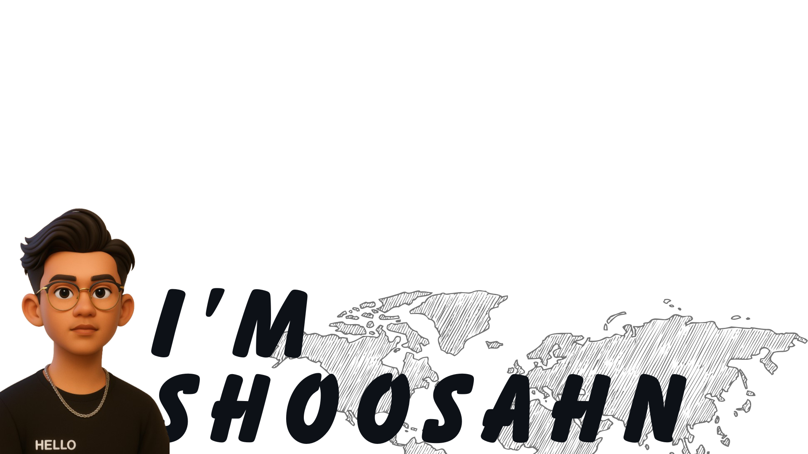

<!-- Profil Image -->

  

---

<!-- Typing Animation -->

  

---

<!-- Pacman Contribution Graph -->

  <picture>
    <source media="(prefers-color-scheme: dark)" srcset="https://raw.githubusercontent.com/Shoosahn/Shoosahn/output/pacman-contribution-graph-dark.svg">
    <source media="(prefers-color-scheme: light)" srcset="https://raw.githubusercontent.com/Shoosahn/Shoosahn/output/pacman-contribution-graph.svg">
    
  </picture>

---

<!-- Tech Stack -->
<h3 align="center">I'm coding with</h3>

  
  
  
  
  
  

---

<!-- Connect -->
<h3 align="center">Connect with me</h3>

  
  
  

 

<!-- Visitor Badge -->

  

